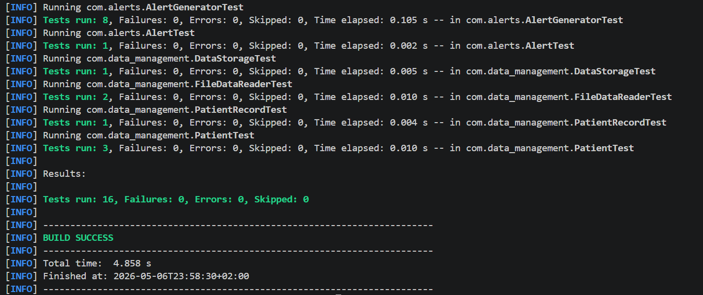
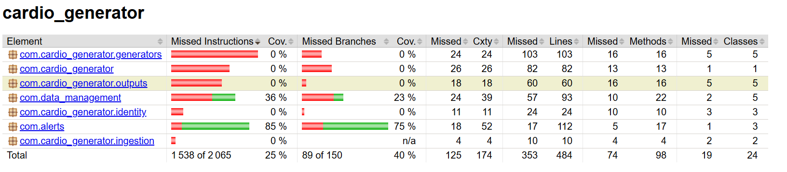

# Cardio Data Simulator

The Cardio Data Simulator is a program that runs on Java. It is used to make cardiovascular data for many patients. This tool is really helpful when we are learning. It lets students work with real time data from things like ECG and blood pressure. They can also see things like blood saturation and other signals that have to do with the heart. The Cardio Data Simulator is very good, for purposes.


## Features

- Simulate real-time ECG, blood pressure, blood saturation, and blood levels data.
- Supports multiple output strategies:
  - Console output for direct observation.
  - File output for data persistence.
  - WebSocket and TCP output for networked data streaming.
- Configurable patient count and data generation rate.
- Randomized patient ID assignment for simulated data diversity.

## Design Patterns (Part 4)
The architecture utilizes several behavioral and creational design patterns to ensure clinical-grade reliability and modularity:
- Singleton: Ensures global state management for the `DataStorage` and `HealthDataSimulator`.
- Strategy: Decouples specific health metric analysis logic (ECG, BP, Oxygen) from the generator.
- Factory Method: Handles the type-safe creation of specialized medical alerts.
- Decorator: Allows for the dynamic extension of alerts with priority and repetition logic.

## Getting Started

### Prerequisites

- Java JDK 11 or newer.
- Maven for managing dependencies and compiling the application.

### Installation

1. Clone the repository:

   ```sh
   git clone https://github.com/tpepels/signal_project.git
   ```

2. Navigate to the project directory:

   ```sh
   cd signal_project
   ```

3. Compile and package the application using Maven:
   ```sh
   mvn clean package
   ```
   This step compiles the source code and packages the application into an executable JAR file located in the `target/` directory.

### Running the Simulator

After packaging, you can run the simulator directly from the executable JAR:

```sh
java -jar target/cardio_generator-1.0-SNAPSHOT.jar
```

To run with specific options (e.g., to set the patient count and choose an output strategy):

```sh
java -jar target/cardio_generator-1.0-SNAPSHOT.jar --patient-count 100 --output file:./output
```

### Supported Output Options

- `console`: Directly prints the simulated data to the console.
- `file:<directory>`: Saves the simulated data to files within the specified directory.
- `websocket:<port>`: Streams the simulated data to WebSocket clients connected to the specified port.
- `tcp:<port>`: Streams the simulated data to TCP clients connected to the specified port.

## License

This project is licensed under the MIT License - see the [LICENSE](LICENSE) file for details.

## Project Members
- Student ID: i6372447
- Student ID: i6436806

## UML Models

The UML class diagrams for Part 2 are located in the [`uml_models`](./uml_models) directory.
They include:
- Alert Generation System
- Data Storage System
- Patient Identification System
- Data Access Layer

The directory also includes `Rationale.txt`, which explains the design choices and responsibilities of all the subsystem.

## Testing

This project uses JUnit 5 for unit testing.

To run all tests:

```bash
mvn clean test
```

To generate the coverage report:

```bash
mvn package
```

The JaCoCo report is generated in:

```text
target/site/jacoco/index.html
```

Current tests include:
- AlertGenerator
- Alert
- DataStorage
- FileDataReader
- Patient
- PatientRecord

## Part 3 Screenshots

### Test Results



### JaCoCo Coverage Report

